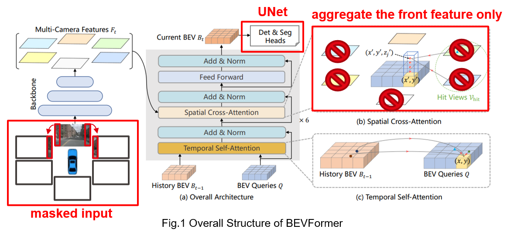

# Final Project: Semantic Segmentation in Bird’s Eye View (BEV)

### Group 7, Xufeng Gao & Haoxin Sun

In this project, we adopt the [BEVFormer](https://github.com/fundamentalvision/BEVFormer), one of the cutting-edge baselines for Learning Bird’s-Eye-View Representation from Multi-Camera Images, to solve the BEV semantic segmentation task. 

## 1. Contribution Overview

Our contributions can be summarized in two aspects (like in the below figure):


### 1.1 Implementation

The original BEVFormer only releases the code for BEV object detection task, thus we **implement the BEV segmentation part** from scratch in this project.

- To be specific, we select the [UNet](https://medium.com/analytics-vidhya/what-is-unet-157314c87634#:~:text=UNET%20is%20a%20U%2Dshaped,channels), one of the most popularly used approaches in any semantic segmentation task today, as the segmentation head.

### 1.2. Only front camera enabled

The original BEVFormer takes 6 surrounding camera images (i.e., front-left, front, front-right, back-left, back, back-right) as input, while in this project we also evaluated the case with the ***only front camera enabled***, which is a more challenging. We derive results in two aspects:

#### Train on 6 surrounding images, test on only front view images
In the training, we use 6 surrounding images to train our model. Then during the test, we evaluate only front-view image inputs in three different ways:
- **Mask**: directly input 5 black/gray/white images in all other views except for the front view image.
- **Mask and Construct**: construct front-left and front-right images from front view images: for front-left (front-right) images, crop 16% portion of the left (right) part on the front-view image and then pad with black/gray/white pixels to the normal image size. Other three images (back, back-left, back-right) keep black.
- **Aggregate Only Front Features**: Change the model and disable it to fetch all other 5 view images except for the front view.

#### Train on 6 surrounding images, then ***fine-tune*** the model on only front view images, and test on only front view images
After training the model on 6 surrounding images, we fine-tune the model after disabling it to fetch other 5 view images (i.e., aggregate only front features). In other words, during our fine-tuning, the model only use front-view images as input. Then we evaluate the fine-tuned model on only front view images.


## 2. Prepare Datasets

**NuScenes** dataset is a large-scale autonomous driving dataset which consists of 1,000 sequences from 6 surrounding cameras (front left, front, front right, back left, back, back right). In total, it has a training set with 28,130 images and a validation set of 6,019 images. Three classes, **lane dividers, lane boundaries and pedestrian crossings** are available to evaluate the BEV segmentation. We use all the **surrounding cameras and the front camera** in the experiments. 

You can prepare the datasets by following below steps.

- Download nuScenes V1.0 full dataset data  and CAN bus expansion data [HERE](https://www.nuscenes.org/download). Prepare nuscenes data by running

  ```bash
  # download 'can_bus.zip'
  unzip can_bus.zip 
  # move can_bus to data dir
  ```

- To organize the folder structure as follows

  ```
  data
  ├── can_bus/			# extract from can_bus.zip
  ├── nuscenes/ 
  │   ├── maps/			# extract nuScenes-map-expansion-v1.3.zip
  │   ├── samples/		# extract File blobs of scenes
  │   ├── sweeps/			# extract File blobs of scenes
  │   ├── v1.0-test/		# extract v1.0-test_meta.tgz
  |   ├── v1.0-trainval/	# extract v1.0-trainval_meta.tgz
  ```

- To generate the annotation files by running

  ```bash
  python tools/create_data.py nuscenes --root-path ./data/nuscenes --out-dir ./data/nuscenes --extra-tag nuscenes --version v1.0 --canbus ./data
  ```

  Using the above code will generate `nuscenes_infos_temporal_{train,val}.pkl`. Because it takes a long time to generate, we provide the ready-download files [HERE](https://drive.google.com/drive/folders/1twLKiezCkzKap1NTDjF4tyDiflZUhR8y?usp=share_link) for your convenience.

- Finally, the data folder structure should be like

  ```bash
  data
  ├── can_bus/
  ├── nuscenes/
  │   ├── maps/
  │   ├── samples/
  │   ├── sweeps/
  │   ├── v1.0-test/
  |   ├── v1.0-trainval/
  |   ├── nuscenes_infos_temporal_train.pkl
  |   ├── nuscenes_infos_temporal_val.pkl
  ```

- The dataset class script is [HERE](./projects/mmdet3d_plugin/datasets/nuscenes_dataset.py).

  

## 3. Experiments

**Setup**. We conduct experiments on the nuScenes dataset with the same setting of [HDMapNet](https://github.com/Tsinghua-MARS-Lab/HDMapNet) . Ego vehicle localization on HD-map is used to define the region of BEV. By using surrounding cameras, the BEV is set to [-30m, 30m] × [-15m, 15m] around the ego vehicle. Only with the front camera enabled, the BEV area is set to [0m, 50m] × [-15m, 15m]. Road structure is represented as line segments with 5-pixel width. The ground-truth mask is set to 400 × 200.

**Evaluation metrics**. For quantitative evaluation, we measure the **intersectionover-union (IoU)** between the segmentation results and the ground-truth:
$$\text{IoU}(S_p,S_g)=\left|\frac{(S_p\cap S_g)}{(S_p\cup S_g)}\right|$$
$$\text{mIoU}(S_p,S_g)=\frac{1}{N}\sum^{N}_{n=1}\text{IOU}_n(S_p,S_g)$$

**Training**. In our experiments, a **weighted cross entropy** loss for 4 classes (i.e., background, lane dividers, lane boundaries and pedestrian crossings) is used to train the model. We train all models with 20 epochs, a batch size of 2 per GPU, a learning rate $2 \times 10^{-4}$, learning rate multiplier of the backbone is 0.1, and we decay the learning rate with a **cosine annealing**. We employ **AdamW** with a weight decay of $10^{-2}$ to optimize our models. More training configurations can be found from [HERE](./projects/configs/bevformer/).

**Fine-tuning**. For the case with only front view enabled, we fine-tune the model for 2 epochs after training it on 6 surrounding images for 20 epochs, the learning rate is set to be $2 \times 10^{-5}$.


## 4. Getting Started

### 4.1. Step-by-step installation instructions

**NOTE: please ensure that the VERSION of each library is correct, newer version may lead to problems**

- **a. Create a conda virtual environment and activate it.**

  ```shell
  conda create -n open-mmlab python=3.8 -y
  conda activate open-mmlab
  ```

- **b. Install PyTorch and torchvision following the [official instructions](https://pytorch.org/).**

  ```shell
  pip install torch==1.9.1+cu111 torchvision==0.10.1+cu111 torchaudio==0.9.1 -f https://download.pytorch.org/whl/torch_stable.html
  # Recommended torch>=1.9
  ```

- **c. Install gcc>=5 in conda env (optional).**

  ```shell
  conda install -c omgarcia gcc-6 # gcc-6.2
  ```

- **d. Install mmcv-full.**

  ```shell
  pip install mmcv-full==1.4.0
  #  pip install mmcv-full==1.4.0 -f https://download.openmmlab.com/mmcv/dist/cu111/torch1.9.0/index.html
  ```

- **e. Install mmdet and mmseg.**

  ```shell
  pip install mmdet==2.14.0
  pip install mmsegmentation==0.14.1
  ```

- **f. Install mmdet3d from source code.**

  ```shell
  git clone https://github.com/open-mmlab/mmdetection3d.git
  cd mmdetection3d
  git checkout v0.17.1 # Other versions may not be compatible.
  python setup.py install
  ```

- **g. Install timm.**

  ```shell
  pip install timm
  ```

- **h. Clone this repo.**

  ```
  git clone https://github.com/vita-student-projects/BEV_Semantic_Segmentation_Gr7.git
  ```


- **i. Prepare pretrained backbone network.**

  ```bash
  cd BEV_Semantic_Segmentation_Gr7
  mkdir ckpts
  
  cd ckpts & wget https://github.com/zhiqi-li/storage/releases/download/v1.0/r101_dcn_fcos3d_pretrain.pth
  ```

  

### 4.2. Run and Eval

- Train BEVFormer with 6 surrounding views using **Multi-GPUs**  
  ```
  bash ./tools/dist_train.sh ./projects/configs/bevformer/segdet_surr.py 0
  ```

- Eval BEVFormer with 6 surrounding views using **Single-GPU**
  ```
  bash ./tools/dist_test.sh ./projects/configs/bevformer/segdet_surr.py './ckpts/best_segdet_surr.pth' 'full'
  ```

- Tips:

  - All configuration files are stored [HERE](./projects/configs/bevformer/).

  - You can find all commands [HERE](./scripts.sh).

  - Before training, please change [dist_tran.sh](./tools/dist_train.sh) to specify the GPU master port & address.

  - Before evaluation, please download the pre-trained models first and move them to ckpts folder. Also, you should specify and create the folder (check the ***show_dir*** argument in [dist_test.sh](./tools/dist_test.sh)) for storing visualization files. 
  - The train and inference scripts are [HERE](./tools/).
  
    

## 5. Model Zoo

Here we provide the pertained models for your evaluation. 

| Backbone | Input | Epoch | mIoU | Config | Download |
| :---: | :---: | :---: | :---: | :---: | ----- |
| [R101-DCN](https://drive.google.com/file/d/1ZeSXDSM_5OeXyYw_mnDPzyb0ygTTVyMl/view?usp=share_link) | Front | 20 (pre-train) + 2 (fine-tune) | **32.70** | [config](./projects/configs/bevformer/segdet_front_finetune.py) | [model](https://drive.google.com/file/d/1Fkz4RxlooZSg5dhiM_ojELc-0nDk65Hz/view?usp=share_link) |
| [R101-DCN](https://drive.google.com/file/d/1ZeSXDSM_5OeXyYw_mnDPzyb0ygTTVyMl/view?usp=share_link) | Surrounding | 20 |**45.5** |[config](./projects/configs/bevformer/segdet_surr.py) |[model](https://drive.google.com/file/d/1T2c9FrVQrIQHdqVmzqgfyCPGZgrbDvcO/view?usp=share_link) |


## 6. Results

### 6.1. Quantitative results

#### Evaluation on 6 surrounding images
We compare our method with previous state-of-the-art methods on the nuScenes dataset when using 6 surrounding images. The BEV range is set as [-30m, 30m] × [-15m, 15m], then the results are summarized in below table. Experimental results show that our method outperforms the previous state-of-the-art approaches on the nuScenes validation set.

|            Method             | Divider | Pred_Crossing | Boundary |   mIoU   |
| :---------------------------: | :------: | :-----------: | :------: | :------: |
| IPM (B) $\dagger$ $\ddagger$  |   25.5   |     12.1      |   27.1   |   21.6   |
| IPM (BC) $\dagger$ $\ddagger$ |   38.6   |     19.3      |   39.3   |   32.4   |
|  Lift-Splat-Shoot $\dagger$   |   38.3   |     14.9      |   39.3   |   30.8   |
|         VPN $\dagger$         |   36.5   |     15.8      |   35.6   |   29.3   |
|      HDMapNet $\dagger$       |   40.6   |     18.7      |   39.5   |   32.9   |
|    BEVSegFormer $\ddagger$    | **51.1** |     32.6      |   50.0   |  44.6  |
|             Ours              |   50.2   |   **35.3**    | **50.9** | **45.5** |

(Note: $\dagger$ means the results are taken from HDMapNet paper, and $\ddagger$ means the corresponding code is unavailable. )

#### Evaluation on only front view image
Using the model trained on 6 surrounding images, we also present our results when only using front view images as input during test. The BEV range is set as [0, 50m] × [-15m, 15m], then the results are shown in the below table. It shows that fine-tuning the model on front view images gives the best results.
|                            Method                            | Divider | Pred_Crossing | Boundary | mIoU  |
| :----------------------------------------------------------: | :-----: | :-----------: | :------: | :---: |
|        Mask (input ***black*** images in other views)        |  34.53  |     12.76     |  29.93   | 25.74 |
|        Mask (input ***gray*** images in other views)         |  33.60  |     13.33     |  30.81   | 25.91 |
|        Mask (input ***white*** images in other views)        |  34.87  |     13.43     |  31.57   | 26.62 |
| Mask and Construct (crop + ***black*** padding in front-left(right) views) |  35.43  |     13.35     |  31.64   | 26.81 |
| Mask and Construct (crop + ***gray*** padding in front-left(right) views) |  34.80  |     13.12     |  31.69   | 26.54 |
| Mask and Construct (crop + ***white*** padding in front-left(right) views) |  35.29  |     13.35     |  32.10   | 26.91 |
|     Aggregate Only Front Features (disable other views)      |  34.94  |     12.52     |  31.69   | 26.38 |
| Aggregate Only Front Features (disable other views), fine-tune on only front images |  **40.58**  |     **19.96**     |  **37.56**   | **32.70** |


BEVSegFormer also evaluates their performance on only front view images, but their view range is set as [0, 60m] × [-15m, 15m], i.e., 10m larger in x-axis than ours. Since our model is trained first on surrounding images, our perception range is only up to 51.2m (the range is set as -51.2m to 51.2m in BEVFormer's paper). So the current model has no knowledge about the area [51.2m, 60m] × [-15m, 15m]. But we still evaluate our model's performance on the range [0, 60m] × [-15m, 15m], and compare it with BEVSegFormer. The results are shown below. It shows that even without information on area [51.2m, 60m] × [-15m, 15m], our model's mIoU is competitive and only 0.3 less than BEVSegFormer, so we believe if we have more time and train the model on a larger perception range, its performance will eventually outperform BEVSegFormer.

|       Method   |  Divider    | Pred_Crossing   |  Boundary    |   mIoU      |
| :------------: | :---------: | :-------------: | :----------: | :---------: |
| BEVSegFormer   |  **37.54**  |      17.82      |   **34.25**  |  **29.87**  |
|    Ours        |    36.71    |     **18.92**   |     33.04    |    29.56    |

### 6.2. Qualitative results

This video visualizes the segmentation results based on the given front-view images. Three images from left to right are raw input image, segmentation prediction, and the groud truth. 


To produce above video, you should run the evaluation code first and then run following code

```bash
python ./utils/compose_vidio.py
```


## 7. Conclusion

In this project, we build a model to do BEV semantic segmentation based on BEVFormer. We first implement a self-designed segmentation head for the model based on UNet. Then we train and evaluate this model in different conditions. When using 6 surrounding images, our results reach SOTA. When using only front-view images, our investigation shows that training it on 6 surrounding images first then fine-tuning on front images can provide a significant performance improvement. And even without perceiving the whole area's information, it still gives a competitive performance with previous SOTA methods.


# Acknowledgement

This project borrows some code from public projects such as BEVFormer, BEVerse, open-mmlab, BEVDet, HDMapNet, etc. Huge thanks to all the projects.
